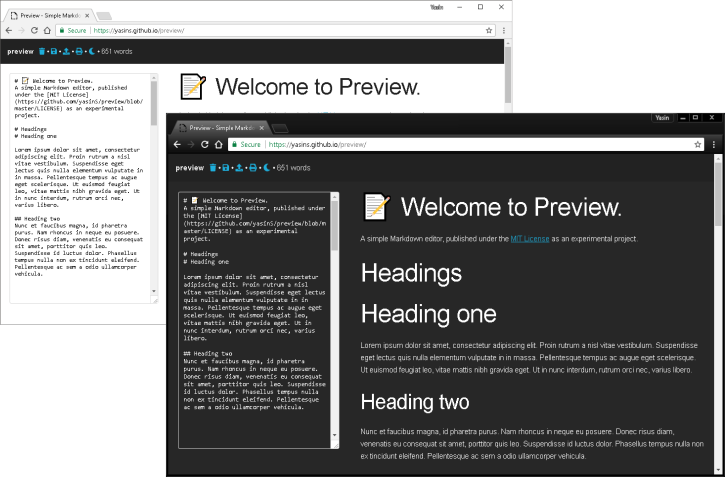

# 📝 preview
A simple browser-based Markdown editor. Published under the [MIT License](https://github.com/yasinS/preview/blob/master/LICENSE) as an experimental project.

## Using the editor
### 🌐 Online version
* Use the latest release build in your browser at **[https://yasins.github.io/preview-live/](https://yasins.github.io/preview-live/)**.
* You can also add the editor to your shelf on Chrome OS devices as a windowed app.

### 💻 Running locally
This project uses [NPM](https://www.npmjs.com/) and Gulp for build management. Before proceeding, check that you have installed [Node](https://nodejs.org/en/download/package-manager) on your system.

1. Clone this repository and `cd` into the `preview` directory
2. Run `npm install` to build and streamline the packages
3. Serve with `npm start` and browse to `http://localhost:8081`

_You can stop the `live-server` instance by executing `npm stop` from the `preview` directory._

## 📓 Features
* Enhanced feature set and live preview powered by [Remarkable](https://github.com/jonschlinkert/remarkable), plus: 
  * GitHub Flavoured tables
  * GitHub Flavoured strikethrough
  * Text footnoting
* Contents autosaved to Local Storage in your browser – nothing remote nor collected externally
* Restrictive HTML sanitisation from [DOMPurify](https://github.com/cure53/DOMpurify)
* Offline-capable with save, load, and print using local browser functions
* Night mode (via toggle button or `?night=1` URL parameter)
* Inbuilt word and character counter
